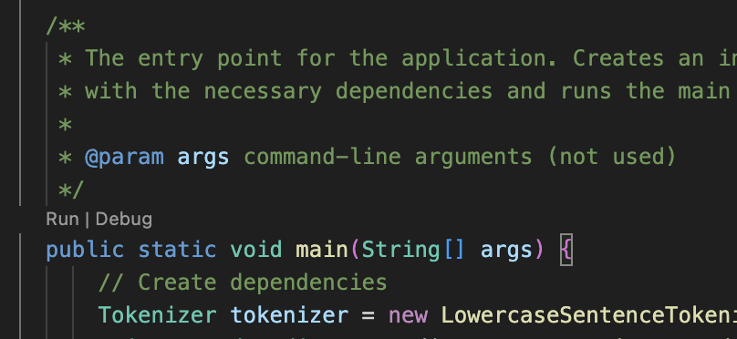
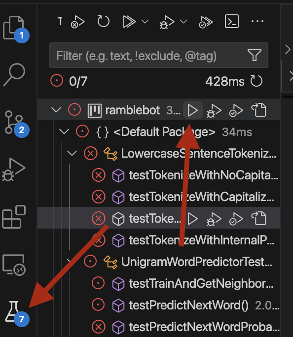

# ramblebot

A project to exercise Java, JUnit, git, GitHub, and code-reading skills. Students will create a language model to generate text.

## Expectations

### Academic Honesty

THIS IS AN INDIVIDUAL PROJECT. The following is not allowed:
- You MAY NOT copy any code from an AI.
- You MAY NOT paste any of the project or your code into an AI.
- You MAY NOT copy another student's code.
- You MAY NOT copy substantial portions of your solution from the internet.

You may:
- You are allowed to talk about the project generally with other students.
- You are allowed to get help from tutors, so long as you write all the code and they do not walk you through step by step.
- You are allowed to get help in office hours.
- You are allowed to use search engines (e.g. "find the last character of a string in Java"). If you copy a small line you found in a search, you must provide a link to where you found it in a comment, AND you must be prepared to thoroughly explain it. If you don't understand it, don't use it!

### Commits

YOU ARE EXPECTED TO MAKE SMALL, FREQUENT COMMITS. Doing so is good practice and helps me see that it's less likely you pasted in a large part of your solution from elsewhere.

### Timeline
This is a large, difficult project. Start early, and get help when you need it.

## Setup

1. Fork and clone this project. MAKE SURE TO CLONE FROM YOUR FORK. The clone URL should have your username in it.
1. Change into the project directory:
    ```
    cd ramblebot
    ```
1. Open the project in VS Code.
    ```
    code .
    ```
    If the above command does not work, you can open VS Code manually and select the ramblebot folder to open.
1. Open `RambleApp.java`. Click anywhere in the text of the file
1. Scroll to the bottom to find the `main` method. There should be a small grey "run" button above it. Click "Run".

Sometimes this button takes a little bit to show up when you first open VS Code. If you're not seeing it, make sure you have the Java extension pack installed and it is active.
1. It should ask you for a filename. Give it the following filename:
    ```
    keatsTraining.txt
    ```
    Then hit enter.
1. It should ask you for a number of words. Enter a positive integer and hit enter.
1. You should expect to see an error message. This is good! The error message should end like this:
    ```
    No tokens returned from tokenizer!
    This is probably because you haven't implemented it yet
    Begin with Wave 1 in the instructions, and implement LowercaseSentenceTokenizer
    If you have implemented it, there's a bug in your code where it's returning null for the tokens.
    ```
1. Open the testing side panel by clicking on the beaker on the left of your screen. 
1. Hover over `ramblebot`. A few grey triangles should appear. Click the triangle the furthest to the left.
1. You should expect to see all the tests fail. This is good! You haven't written your solution yet, so it's expected for them to fail.
1. Validate that you can push to your repo by making any change to this README, adding, committing, and pushing it.

## Understanding the Project

The goal of this project is to make a bot that can generate new text in the style of some writer. It will do this by reading some input writing, and then word-by-word generating new text that mimics it.

## Wave 1
In wave 1, you will start implementing `tokenize` in `LowercaseSentenceTokenizer.java`. The goal is to take a scanner, read through it, and return a list of words that were separated by spaces/newlines. For example, if the scanner had the following text:
```
this is a lowercase sentence without a period
```
Then tokenize should return a list that looks like this:
```
["this", "is", "a", "lowercase", "sentence", "without", "a", "period"]
```

I recommend not yet worrying about periods or capitalization. You will improve your code in later waves to handle this. `testTokenizeWithNoCapitalizationOrPeriod` in `LowercaseSentenceTokenizerTest` will exercise this functionality. The other tests will likely still fail. This is OK! You'll tackle them in later waves. Add commit and push your code if you have not already!

## Wave 2
In wave 2, you will add your own test. You should test that your code properly handles input with many spaces. For example, something like: 
```
hello     hi hi hi    hello hello
```
Write your test in `LowercaseSentenceTokenizerTest` where indicated by the comment, and verify it passes. Fix any bugs in your code if you find them. Add commit and push your code if you have not already!

## Wave 3
In wave 3, you will finish the implementation of `tokenize`. Read the Javadoc carefully to understand what to do. Successfully completing this wave should make the remaining tests in `LowercaseSentenceTokenizerTest` pass. Add, commit, and push your code!

## Wave 4
In wave 4 you will finish the implementation of `train` in `UnigramWordPredictor`. There is already one line of the implementation provided for you, you do not need to change it. Write the rest of te implementation below it. Read the Javadoc on `train` carefully to understand what is expected. I also recommend reading `testTrainAndGetNeighborMap` in `UnigramWordPredictorTest` as it gives an example input/output. Successfully completing your code should make that test pass. This method is probably the hardest part of the project. Look back at compound data structures and ask for help from tutors or in office hours if needed. Make sure to add, commit, and push your code frequently!

## Wave 5
In wave 5 you will implement `predictNextWord` in `UnigramWordPredictor`. As part of implementing this, you will need to research how to generate random numbers in Java. Read the Javadoc carefully, and read the comments on the remaining tests. Once you complete this wave, all tests in the project should pass.

## Wave 6
In wave 6 you will validate that your bot works by having it generate new text. Choose some source of text (poems, songs, essays, etc) and put it in a new file in the root of the repository. Name it something descriptive like `oscarWildeTraining.txt`.

Then, run the main method of `RambleApp.java` again (see instructions partway through the Getting Started section). Have it use your new text file. Have it generate at least 100 words. Save the output into a new file `ramblebotOutput.txt`. Experiment with different training data sources and see if you can have it make something funny/interesting/profound!

Once you have it working and passing tests, congrats! You are finished! Make sure to add, commit, push, open a PR, and submit the link on Canvas. You can choose to continue on to the bonus extensions even if you have already made a PR. Your PR will automatically be updated with new commits you push.

## Bonus Extensions
Consider doing any of the following (some are very hard!):
- Adding more tests to the classes you implemented
- Testing `RambleApp`
- Creating a Bigram predictor
- Making your Unigram predictor memory-efficient (hint: consider how you can avoid keeping redundant copies of words)
- Making RambleApp memory-efficient
- Anything else you find interesting!

## Submitting
Submit your project by making a PR and copying the link to the canvas assignment.

TURN SOMETHING IN BY THE DUE DATE EVEN IF YOU'RE NOT FINISHED.
